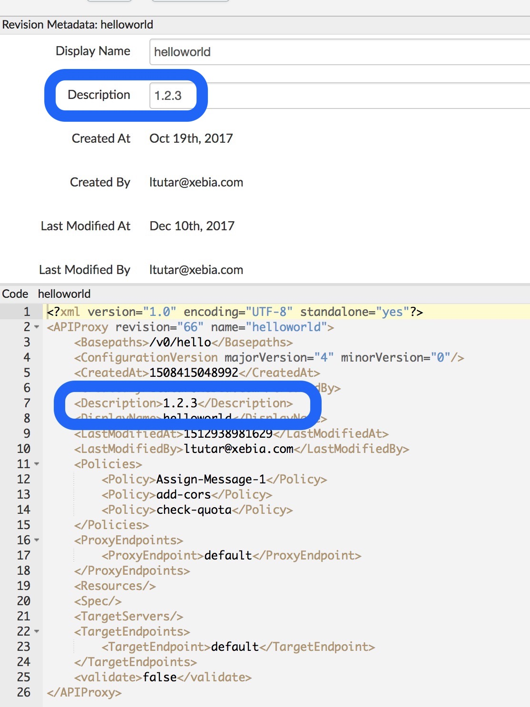
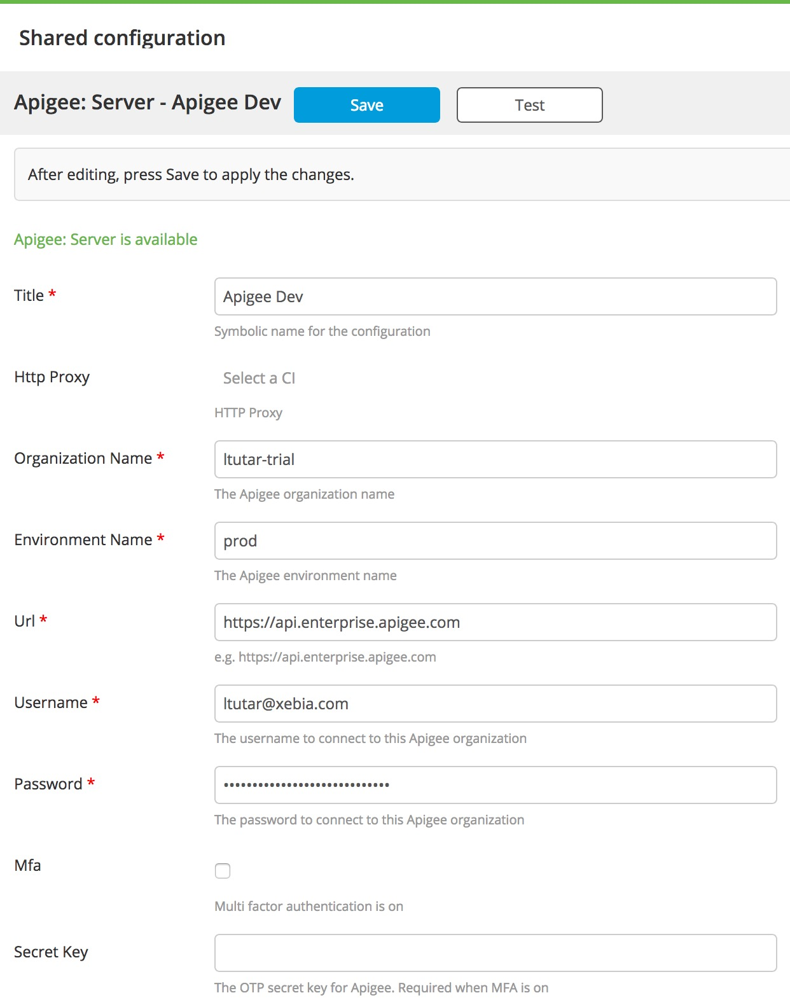
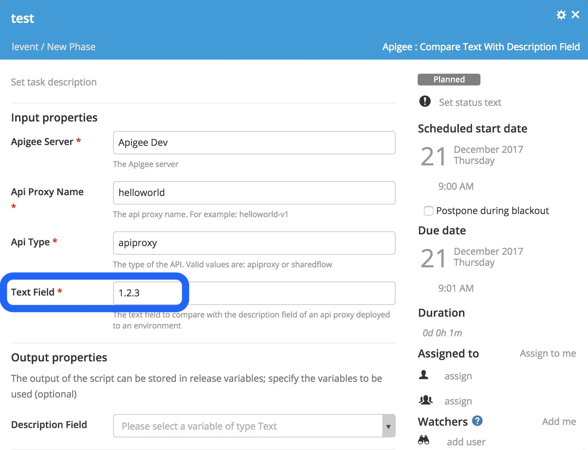
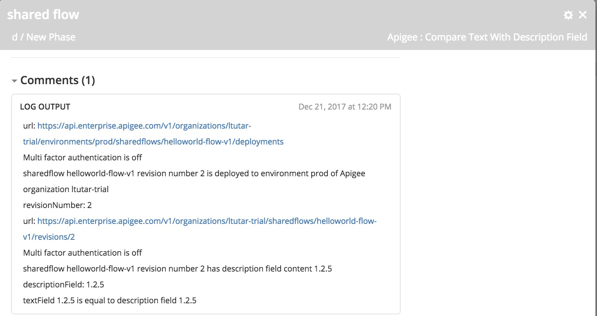

# Apigee Test plugin


[![Build Status][xlr-apigee-test-plugin-travis-image]][xlr-apigee-test-plugin-travis-url]
[![License: MIT][xlr-apigee-test-plugin-license-image]][xlr-apigee-test-plugin-license-url]
![Github All Releases][xlr-apigee-test-plugin-downloads-image]

[xlr-apigee-test-plugin-travis-image]: https://travis-ci.org/xebialabs-community/xlr-apigee-test-plugin.svg?branch=master
[xlr-apigee-test-plugin-travis-url]: https://travis-ci.org/xebialabs-community/xlr-apigee-test-plugin
[xlr-apigee-test-plugin-license-image]: https://img.shields.io/badge/License-MIT-yellow.svg
[xlr-apigee-test-plugin-license-url]: https://opensource.org/licenses/MIT
[xlr-apigee-test-plugin-downloads-image]: https://img.shields.io/github/downloads/xebialabs-community/xlr-apigee-test-plugin/total.svg

## Preface

This document describes the functionality provided by the XL Release Apigee plugin.

See the [XL Release reference manual](https://docs.xebialabs.com/xl-release) for background information on XL Release and release orchestration concepts.  

## Overview

This XL Release plugin can compare a text string with the description field of an API Proxy that is deployed to an Apigee environment. 
It is difficult to keep a track of the revisions that are deployed to different Apigee organizations. This is because of the fact that each Apigee organization repository comes up with its own revision numbers. The API Proxy helloworld can be revision 11 on Apigee organization ltutar-trial and be revision 2 on Apigee organization ltutar-eval. In order to overcome this problem, we inject our git tag version i.e. 1.2.3 to the description field of API Proxy Metadata before deploying to an Apigee environment. After deployment of the API Proxy, we can use this XLR plugin to compare the value of our git tag version with the content of the description field.

Remark: This XLR plugin does not deploy an Apigee API Proxy or an Apigee shared flow to an Apigee environment. You can use the [XL Deploy Apigee plugin](https://github.com/xebialabs-community/xld-apigee-plugin) to deploy an Apigee application to an Apigee environment. This XLR plugin can be used as a smoke test after a deployment e.g. did I really deploy the Apigee API Proxy or Apigee shared flow with a predefined description field to the Apigee environment?





## Requirements

* XL Release 7.0+

## Installation

* Copy the latest JAR file from the [releases page](https://github.com/xebialabs-community/xlr-apigee-test-plugin/releases) into the `XL_RELEASE_SERVER/plugins` directory.
* Restart the XL Release server.

## Usage

### Creating the shared configuration

1. Go to `Settings` -> `Shared configuration`
2. Click on `Add Server` of `Apigee:Server`
3. Fill in the values and click on `Save` and `Test`. 
   - If an HTTP Proxy is needed, please create one of type `Remote Script: HTTP proxy` from `Settings` -> `Shared configuration`
   - See the Note below

### Choose Task

1. Click on `Add Task` in the XLR template.
2. Choose `Apigee:Compare Text With Description Field`
3. Fill in the values.


### Note: Apigee Server connection problems
If there are problems connecting to the Apigee server, then you may get the following error
```python
requests.exceptions.SSLError: [Errno 1] Illegal state exception in <script> at line number 18
```
click on `retry` again.

### Screenshots

#### Screen shot of shared configuration


#### Screen shot of Apigee task


#### Screen shot of equal content between text and description field


#### Screen shot of unequal content between text and description field

